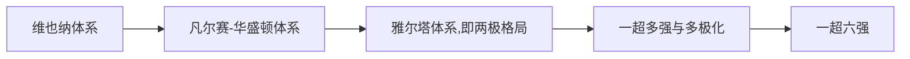

# 形势与政策思考题总结

3200100667 范天宇

### 国家安全问题

#### 如何理解总体国家安全观？

 - **坚持统筹发展和安全两件大事**

    - **发展是安全的基础**，建立在发展基础上的安全才更可靠、更可持续。

    - **安全是发展的保障**，一个国家选择什么样的国家安全战略，决定了这

      个国家生存、发展与兴盛之路。

 - **坚持人民安全、政治安全、国家利益至上有机统一**

    - 以人民安全为宗旨
    - 以国家利益至上为准则
    - 以政治安全为根本

 - **坚持维护和塑造国家安全**

    - 立足国际秩序大变局来把握规律
    - 立足防范风险大前提来谋划思路
    - 立足发展历史机遇期大背景来统筹工作

-  **坚持科学统筹的根本方法**

#### 大学生应该如何维护国家安全？

 - **每个学科都是国家安全领域的组成部分**，学好本领，每个学生都应该具有知识报国、科技报国的家国情怀和远大理想。

 - 从大局意识上了解把握中央维护国家安全的战略目标、基本原则、重点内容、策略方法等。**树立总体国家安全观，**维护国家利益和国家安全。

 - **履行公民职责**：《国家安全法》第七十七条公民和组织应当履行的维护国家安全的义务。

 - **警惕网络陷阱**

    - 小心“兼职”陷阱
    -  防范网络窃密

 - **强化防范意识**

    - 警惕金钱诱惑、警惕感情拉拢、警惕威逼胁迫

 - **抵御校园渗透**

   

### 当代国际格局中的国际关系与国家利益

#### 国际格局经历了哪几种演变？主要特征有哪些？

 - 维也纳体系

   19世纪初拿破仑帝国崩溃后，以英、俄、奥、普为首的战胜国通过维也纳会议在欧洲大陆上建立的新均势体系；

 - 凡尔赛华盛顿体系

   一战后，通过巴黎和会和华盛顿会议，帝国主义列强建立了“凡尔赛—华盛顿体系”，它确立了帝国主义在欧洲、西亚、非洲、东亚以及太平洋地区的统治秩序，是一战后帝国主义国家重新瓜分世界,奴役殖民地半殖民地的体系；

 - 两极格局

   二战后，美国经济、军事实力膨胀，苏联成为惟一能与美国抗衡的政治、军事大国，在美苏实力的基础上，根据雅尔塔等会议规定的原则，重新划分了世界版图和势力范围，确立了战后新的国际关系格局；

 - 一超多强与多极化

   随着东欧剧变（20世纪80年代）、苏联解体（1991年），美苏对立的两极格局结束，世界形成了“一超（指美国）多强（多指中国、欧盟、俄罗斯与日本）”的世界格局，但是这一世界格局并不稳定。随着中国改革开放、欧盟一体化建设、俄罗斯振兴经济的计划以及日本的经济力量，世界格局正在走向多极化。

 - 一超六强

   美国|中欧俄 日印巴西

   

   #### 主要特征

    - 三个总体、三个局部
       - 总体和平局部战争、总体缓和局部紧张、总体稳定局部动荡
    - 三个继续
       - 世界和平发展潮流继续
       - 世界多极化、全球化趋势继续
       - 国际形势中机遇大于挑战的态势继续
   - 四个化
     - 时代主题明朗化（战争与革命-->和平与发展）
     - 世界格局多极化
     - 经济趋于全球化
     - 安全环境复杂化
       - 全球性：霸权主义与强权政治
       - 地区性：恐怖主义、分裂主义与极端主义

#### 举例分析为什么国家利益是处理国际关系的核心

- 国家利益是国家对外活动的出发点与归宿，是主权国家指定和实施对外政策的基本依据，是其对外活动的主要目的
- 国家共同利益是国家合作的基础，利益的对立是国家间分歧、摩擦乃至冲突的根源
- 举例：
  - 美国发动的伊拉克战争
    - 在为美国开列的各种理由中，包括铲除恐怖主义、捍卫国土安全、推翻独裁政权、争夺石油利益、确保美国中东霸权、改造伊斯兰世界、发泄对“9·11”袭击的愤怒、振兴美国经济、巩固单极世界等等。这些理由概括起来反映了美国国家利益的三大核心内容：安**全利益、经济利益和价值利益。**每当美国发动或卷入一场战争时，无论从动机还是结果看，都会涉及维护和扩大以这三项基本利益为内容的国家利益。
  - 一带一路建设
    - 围绕"一带一路"建设,习近平总书记指出,"一带一路"建设不是空洞的口号,而是看得见,摸得着的实际举措,将给地区国家带来实实在在的利益
    - 中国始终坚持和平发展、坚持互利共赢。我们愿同合作伙伴一道，把‘一带一路’打造成团结应对挑战的合作之路、维护人民健康安全的健康之路、促进经济社会恢复的复苏之路、释放发展潜力的增长之路。通过高质量共建‘一带一路’，携手推动构建人类命运共同体。
    - “一带一路”倡议是共商共建共享的联动发展倡议，追求的是更加平等的新型国际关系，与西方国家借对外援助、提供贷款等方式对其他国家“发号施令”、强加于人的政治行为截然不同。作为全球发展的建设者，中国通过“一带一路”国际合作为沿线国家的发展做出切实贡献。

#### 大学生应怎样有效维护国家利益？

**1、全面正确理解我国外交方针政策**

 - 根据十九届五中全会要求，外交政策总基调是实行高水平对外开放，开拓合作共赢新局面。
 - 坚持中国外交原则立场：发挥大国坚持国家利益高于一切，一切外交都必须服从国家利益。

**2、充分认识国力壮大是维护国家利益的根本保证**

	- 弱国无外交，落后就要挨打。 
	- 关键是要把自己建设得更强大。 
	- 中华民族伟大复兴，绝不是轻轻松松、敲锣打鼓就能实现的。 

**3、大学生应以实际行动维护国家利益**

	- 积极宣传我国外交方针政策。对抗和合作都是为了争取国家利益。
	- 冷静、理性处置国家政治生活中的涉外事件。
	- 学好本领，成为中华民族伟大复兴的主力军。

### 抗疫大考的中国答卷

	- 这张答卷彰显了以习近平同志为核心的党中央的坚强领导
	- 这张答卷显示了中国特色社会主义制度的显著优势
	- 这张答卷见证了中国人民坚韧风险、守望相助的民族精神
	- 这张答卷检验了我国治理体系和治理能力的效能水平
	- 这张答卷展现了改革开放以来积累的雄厚物质技术基础
	- 这张答卷书写了践行人类命运共同体理念的大国担当

#### 对比中西方抗疫答卷，我们的制度有哪些显著优势？

 - **集中力量办大事。**这次疫情防控斗争，党中央统一指挥、统一协调、统一调度，构建起联防联控、群防群控的防控体系，充分体现了全国一盘棋的合力优势。
 - **紧紧依靠人民群众**。疫情发生以来，党中央始终坚持以人民为中心，始终将保障人民群众生命健康视为重中之重，千方百计提高收治率和治愈率、降低感染率和病死率，不计一切代价拯救人民生命，并根据疫情对群众生产生活的影响，切实解决就业等人民群众生产生活难题。特别是采取兜底政策着力解决困难群众的生活问题，充分彰显了中国共产党人民至上的价值取向、执政理念和我们党忧民、爱民、重民、护民的赤子之心。
 - **以人民为中心**。同资本主义国家名义上“民有民治民享”，实际上以金钱资本为中心不同，我们始终把人民群众的生命安全和身体健康放在第一位。这次抗疫斗争，生动地体现了我们党的人民立场和坚持人民至上的根本价值取向，也生动地体现了中国特色社会主义制度承载的坚持人民至上的价值优势。

#### 在后疫情时代，作为大学生的你能做些什么？

### 中国经济发展与当前形势

#### 中国共产党为什么能？

 - 科学的理论指导
 - 坚定的理想信念
 - 强大的组织优势
 - 坚实的群众基础
 - 彻底的自我革命（勇于自我革命是中国共产党最鲜明的政治品格）

#### 谈一谈我们如期打赢脱贫攻坚战的重大意义

##### 对国家

 - 兑现了我们党向人民与历史做出的庄严承诺，彰显了中国共产党领导和我国社会主义制度的政治优势。
 - 困扰中华民族几千年的绝对贫困问题取得历史性成就，在共同富裕道路上迈出坚实一步。
 - 人民群众获得感、幸福感、安全感显著增强
 - 脱贫攻坚的重大胜利，为实现第一个百年奋斗目标打下坚实基础，极大增强了人民群众获得感、幸福感、安全感，彻底改变了贫困地区的面貌，改善了生产生活条件，提高了群众生活质量，“两不愁三保障”全面实现。
 - 解决了全面建成小康社会的底线任务和标志性指标，确保如期全面建成小康社会、实现第一个百年奋斗目标，为开启全面建设社会主义现代化国家新征程奠定坚实基础。
 - 消除贫困、改善民生、实现共同富裕，是中国特色社会主义的本质要求，是中国共产党的重要使命，也是彰显我国社会主义制度巨大优越性的体现。

##### 对世界

 - 提前 10 年实现联合国 2030 年可持续发展议程的减贫目标，创造了人类反贫困史的中国奇迹，加快了全球减贫进程，增强了全世界消除绝对贫困、实现联合国 2030 年可持续发展目标的信心。
 - 为全球贫困治理提供中国方案，为人类减贫事业贡献中国智慧

#### 十三五期间，党的领导核心作用是如何彰显的

	- **面对经济下行的压力，**坚定不移贯彻新发展理念、坚定不移推进供给侧结构性改革，着力突破制约经济增长潜力充分释放和高质量发展的体制机制障碍。
	- 面对**区域发展不平衡**的挑战，党中央精心谋划、科学布局，多项改革不断升入推进，京津冀协同发展、长江经济带发展、粤港高大湾区建设、推进南海全面深化改革开放、深入推进东北振兴、长三角一体化发展、黄河流域生态保护高质量发展、成渝地区双城经济圈建设等一个国家重大战略打通区域协调发展“经络”，推动我国区域协调发展不断向着更加均衡、更高层次、更高质量方向阔步前进。
	- 面对突如其来的**新冠疫情**，党中央迅疾成立中央对疫情工作领导小组，先后召开30余次领导小组会议，研究部署疫情防控和统筹推进经济社会发展的重大问题和重要工作。
	- 面对**经济全球化遭遇逆流及单边主义、保护主义抬头**，党中央坚定站在历史正确的一边。我国在实现自身发展同时，为各国带来更多市场机遇、投资机遇、增长机遇。
	- **启示：**无论在重大历史关头，还是在重大考验面前，党中央的判判断力、决策力、行动力具有决定性作用。在新的征程上，越是任务艰巨。越是风险挑战增大，越要把党的领导这个最本质特征坚持好、这个最大优势发挥好。越要增强“四个意识”、坚定“四个自信”、做到“两个维护”

#### 五年规划为何能够在引领经济社会发展中发挥出重要的作用？

 - 始终坚持党的领导、体现党的主张。只有紧紧围绕党确立的社会主义现代化建设战略目标，不折不扣落实党中央精神，切实将党中央的决策部署转化为国家意志和全体人民的奋斗方向，把党的强有力领导贯穿规划实施全过程，国家发展规划才能始终保持正确方向、有效发挥引领作用。
 - 始终坚持以马克思主义政治经济学最新理论成果为指导。理论是行动的先导，是规划的灵魂。随着中国特色社会主义理论不断丰富完善，国家发展规划的指导思想也持续演进发展。

#### 为社么说推动高质量发展是适应我国社会主要矛盾变化和全面建成小康社会、全面建设社会主义现代化国家的必然要求？

 - 我国社会主要矛盾已经转化为人民日益增长的美好生活需要和不平衡不充分的发展之间的矛盾。推动高质量发展，是满足人民日益增长的美好生活需要的发展，是体现创新、协调、绿色、开放、共享五大发展理念的发展。

 - 中国特色社会主义进入了新时代，我国经济发展也进入了新时代，基本特征就是我国经济已由高速增长阶段转向高质量发展阶段。
 - 推动高质量发展，是保持经济持续健康发展的必然要求，是适应我国社会主要矛盾变化和全面建成小康社会、全面建设社会主义现代化国家的必然要求，是遵循经济规律发展的必然要求。
 - 要坚定不移走中国特色自主创新道路，深化科技体制改革，不断开创国家创新发展新局面，加快从经济大国走向经济强国。实施创新驱动发展战略，是立足全局、面向未来的重大战略，是加快转变经济发展方式、破解经济发展深层次矛盾和问题、增强经济发展内生动力和活力的根本措施。（习的讲话）

### 全面从严治党

#### 如何正确认识人类面临的腐败问题？

	- 腐败产生的根本原因，那就是权力在运行过程中缺乏有效地监管和牵制，当权者在运用人民赋予的公共权力分配社会各项资源的时候，由于人性上的弱点，导致资源分配丧失公平。
	- 腐败作为一种普遍社会现象，其发生和发展在任何一个历史时期和世界上不同制度的国家和地区都普遍存在的。认为腐败只有中国才有或者说中国最严重是一种偏激的认识，其实世界上不管是社会主义国家还是资本主义国家腐败比中国严重的都大量存在。
	- 改革开放以来，我过正处于社会发展不断探索与成熟阶段，各种观念的入侵与交织，经济的高速发展，反腐制度措施的不完善，法律法规不健全等一系列的综合原因导致我国的腐败发生率相对于改革开放之前有了相当大增加。
	- 我们必须要正确的认识到，这种腐败的增加是社会经济在发展过程中必然出现的一个正常的社会现象，纵观资本主义发达国家在经历我国目前的经济发展阶段时基本都出现了我国目前所存在的包括腐败在内的各种问题。广大人民群众必须要正确的认识腐败产生的根本原因和现阶段我国的国情，才能从根本上树立对党执政兴国的信心，激发对生活工作的热情。

#### 十八大以来近十年我国反腐败的特点和成就？

 - 特点
    - **高层**亲自推动，**旗帜鲜明**、多管齐下。党的最高领导层这种**巨大的政治勇气和决心**，是反腐败斗争能够取得成效并形成压倒性态势的关键所在。
    - **密集出拳**，采用查办、约谈、巡视、清退、建立网络举报监督专区等多种形式，让腐败无处可逃。推出的举措不是单一的、独立的，而是**全面的大小统打**。一改打苍蝇多，打老虎少;打下头多，打上头少;打贪贿多，打其他犯罪少;打现行多，打退位少的状况，坚持苍蝇、老虎一齐打、上头下头一齐打、贪贿腐败分子与作风败坏的腐败分子一齐打、在职的与退下来的一齐打。
    - **群众参与**，形成反腐的人民战争。网络反腐成效显著。实名举报不断涌现。一改依靠少数人反腐败、依靠专门机关反腐败的布局，**坚持与发扬了依靠群众的路线**。

 - 成就
    - 反腐败成为国家治理战略重要内容。十八大报告在党风廉政建设和反腐败工作部署方面，有三个“第一次”：第一次把反腐倡廉建设放在了党的五大建设的第四位。第一次在党代会的报告中提出了建设廉洁政治的目标，要求做到干部清正、政府清廉、政治清明。第一次在党代会报告中把党的纪律建设作为一个专门的问题来阐述、进行要求。
    - 制度笼子在越扎越紧、越扎越密的同时，**制度的执行力亦得到空前释放**，逐步形成不敢腐的惩戒机制、不能腐的防范机制、不想腐的保障机制。权力运行制约和监督体系不断健全，有权必有责、用权受监督、失职要问责、违法要追究正在成为各级领导干部和国家公职人员的思想自觉和行动自觉。
    - 国内“打虎”“拍蝇”，国际“天网”“猎狐”。随着一批潜逃海外多年的贪腐分子归案，中国反腐用有力的行动证明，**海外不是法外，出逃不是出路**，海外决不是腐败分子的“避罪天堂”，不管腐败分子跑到哪里、跑出去多久，都要一追到底、绳之以法。
    - 随着反腐败斗争成效凸显，中国反腐开始占据国际道义制高点，不仅赢得国际社会尊重，也推动构建国际反腐新秩序。**中国正成为国际社会反腐败的一面旗帜**。

#### 作为当代大学生如何践行自己清廉的人生之路？

### 人类命运共同体-中国共产党的担当与贡献

#### 结合自身学科和专业，青年大学生应该如何讲好中国故事？

 - 讲好中国故事的立论之本、情感之基、力量之源
   	- 构建大时代的逻辑框架
   	- 使用小故事的文本结构
   	- 打造中国风的话语体系
   	- 应用国际范的叙事技巧

#### 在日常公共外交中，当代青年可以做些什么？

#### 在中国推动构建人类命运共同体的实践中，你可以贡献什么？

### 海洋强国战略

#### 如何理解海洋强国战略？

	- 认识重要意义
	- 坚持陆海统筹
	- 发展海洋科学技术
	- 保护海洋生态
	- 建设强大海军
	- 发展海洋经济

#### 中国海洋强国战略的灵魂是什么？

 - **是海洋意识**
   	- 海洋意识和战略作为一种精神力量，能够在人们认识世界、改造世界的过程中转化为物质力量，对社会发展产生深刻的影响。
   	- 文化与经济、政治相互影响、相互交融。海洋意识和战略反作用于一定的经济、政治。能够为海洋强国建设提供正确的方向保证、不竭的精神动力和强大的智力支持，会促进经济的发展。在经济发展中，科学技术的作用越来越重要，文化生产力在现代经济的总体格局中的作用越来越突出。
   	- 文化越来越成为民族凝聚力和创造力的重要源泉，越来越成为综合国力的重要因素。不同的民族文化，影响不同民族和国家各具特色的发展道路；文化是综合国力竞争中维护国家利益与安全的重要精神武器。

#### 在海洋强国战略中，大学生可以有什么作为？

### 学百年党史，走复兴之路

#### 中国新民主主义革命胜利的基本经验何在？

 - 中国共产党之所以能够把革命引向胜利，一条根本性的经验就是，**必须坚持把马克思列宁主义的基本原理和中国的具体实际结合起来，不断推进马克思主义中国化的事业**。正是在中国化的马克思主义理论——**毛泽东思想**指引下，中国共产党制定了正确的理论、纲领、路线、方针和政策，找到了适合本国国情的革命道路。
 - **建立广泛的统一战线。**建立广泛的统一战线，是坚持和发展革命的政治基础。统一战线中存在着两个联盟：一个是工人阶级同农民和其他劳动人民的联盟，主要是工农联盟；一个是工人阶级同民族资产阶级和其他可以合作的非劳动人民的联盟，主要是同民族资产阶级的联盟，有时还包括与一部分大资产阶级的暂时的联盟。前者是基本的、主要的；后者是辅助的、同时又是重要的。必须坚决依靠第一个联盟，建立和扩大第二个联盟。巩固和扩大统一战线的关键，是坚持工人阶级及其政党的领导权。为此，必须率领同盟者向共同的敌人作坚决的斗争并取得胜利；必须对被领导者给以物质福利，至少不损害其利益，同时对被领导者给以政治教育；必须对同工人阶级争夺领导权的资产阶级采取又联合、又斗争的政策。
 - **坚持革命的武装斗争。**　由于中国没有资产阶级民主，反动统治阶级凭借武装力量对人民实行独裁恐怖统治，中国人民的革命只能以长期的武装斗争作为主要形式。离开了武装斗争，就没有共产党的地位，就不能完成任何革命任务。**为了坚持和发展中国革命，必须建立一支在工人阶级政党绝对领导下的、具有严格纪律的、同人民群众保持亲密联系的新型人民军队。**没有一支**人民的军队**，便没有人民的一切。这支军队必须实行一系列具有中国特点的人民战争的战略战术。
 - **加强共产党自身的建设。**中国共产党的建设，是紧紧围绕党的政治路线进行的，注重在端正思想路线的基础上，**制定和贯彻执行党的正确的政治路线。**中国共产党首先着重党的思想建设尤其是理论建设，要求党员认真学习和运用马克思主义的立场、观点、方法，解决实践中遇到的问题，努力用工人阶级思想克服资产阶级、小资产阶级思想，解决思想上入党的问题；坚持一切从实际出发、实事求是的思想路线；培育和发扬理论联系实际、密切联系群众、批评和自我批评的作风；在党内斗争中实行“惩前毖后，治病救人”的方针。并创造了整风等新的形式，在全党通过批评与自我批评进行马克思主义思想教育。**同最广大的人民群众取得最密切的联系，这是中国共产党区别于其他任何政党的一个显著的标志。**由于坚持全心全意为人民服务的宗旨，一切从人民的利益出发；坚持相信群众、依靠群众的方针；坚持从群众中来、到群众中去的工作路线；这就使得中国共产党能够受到人民真心的拥护和支持，能够使自己不断地从群众中汲取智慧和力量，从而克服前进道路上的各种困难和风险，而赢得胜利。

#### 如何理解新时代中国共产党的历史使命？

 - **在历史和现实的统一中深刻理解新时代党的历史使命。**历史的长河大浪淘沙， 也昭示历史担当者的风采。 实现中华民族伟大复兴是近代以来中华民族最伟大的梦想， 谁能够承担起这个历史使命， 谁就能赢得中国各民族人民的衷心拥护，成为中华民族的主心骨。在历史的反复比较中， 在各种政治力量的反复较量中， 马克思列宁主义同中国工人运动相结合过程中， 中国共产党应运而生。 **我们党一经成立， 就义无反顾肩负起实现中华民族伟大复兴的历史使命。**
 - **理解把握实现新时代党的历史使命新要求。**习总书记在党的十九大报告中要求全**党同志必须紧紧围绕实现伟大梦想去进行伟大斗争、建设伟大工程、推进伟大事业。**这一重大理论概括，揭示了新时代我们党实现政治理想和政治目标的总方略，绘就了新时代伟大梦想的愿景蓝图，体现了奋斗目标、实现路径、前进动力的无缝链接，**彰显了党、国家和民族三者前途命运的高度统一。**
 - **我们党要始终保持同人民群众的血肉联系。**更好地坚持以人民为中心的发展思想，始终牢记全心全意为人民服务的根本宗旨，把人民利益放在第一位，把人民群众对美好生活的向往作为我们的奋斗目标；实事求是地研究分析人民群众真切需要的时代特点。
 - **始终注重加强党的自身建设。打铁必须自身硬。**崇高的历史使命、宏伟的战略目标从客观上要求我们党要始终成为时代先锋、民族脊梁，就必须把加强和改进党的自身建设作为重大课题，坚定不移推进全面从严治党。

